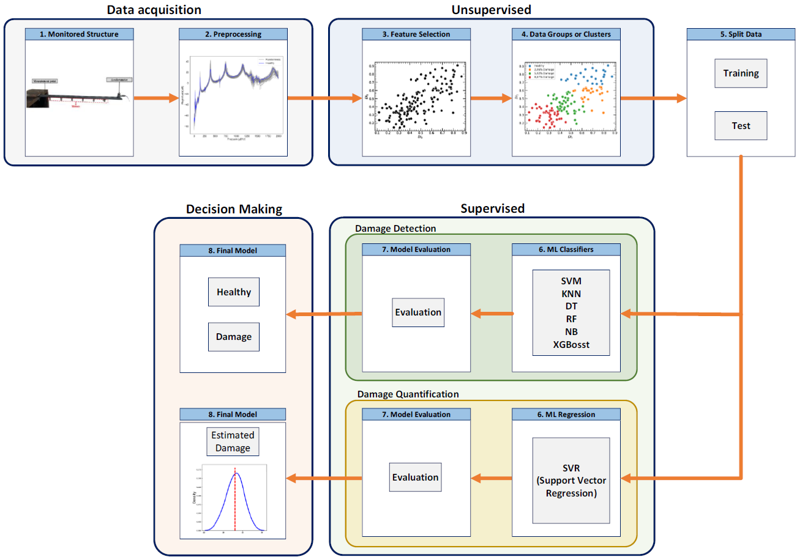

# PyMLDA - Machine Learning for Damage Assessment

## About
The PyMLDA software refers to a computer program based on Python that provides a comprehensive and effective approach to monitoring the structural integrity of systems and structures using signatures based on dynamics and vibration. By integrating experimental data and machine learning techniques, the software offers an effective tool for assessing structural integrity through structures' dynamic response. The approach combines supervised and unsupervised machine learning (ML) algorithms to address the challenges associated with assessing damage in a structure.
The applied dataset uses dynamic response (natural frequency, frequency response function (FRF), time or frequency spectrum) obtained from numerical or experimental tests to calculate a damage index (DI) under healthy and damaged conditions, serving as input for the algorithms. The framework employs a variety of validation and cross-validation metrics to assess the effectiveness and accuracy of these machine-learning algorithms in detecting and diagnosing structure-related issues. The PyMLDA software includes graphical features for visualizing the results of the classification model.
Initially, the algorithm aims to automatically extract patterns and features from the data by reading through damage indices. Subsequently, the algorithm is employed to identify the damage state using classification techniques (damaged or healthy) and regression (e.g., damage size, variability associated with estimation, etc.).
From the processed data, if necessary for the user, it is possible to determine actions to correct the structure or components and implement appropriate measures. Hence, PyMLDA software applies to monitoring structures through their dynamic response, using machine learning algorithms to identify and quantify damage.

## PyMLDA workflow

The software encompasses eight steps in total, comprising receiving the normalised acquired data (step 1), an unsupervised stage involving data processing (step 2), feature selection (step 3), and pattern recognition and clustering (step 4). These steps form the Data-Driven Processing and Pattern Recognition. Subsequently, data splitting is performed in step 5. In the supervised stage, classification ML algorithms (steps 6 and 7) are utilised for damage detection, and regression (steps 6 and 7) is applied for damage quantification. Finally (step 8), the algorithm furnishes information regarding the damage state based on the classification and regression algorithm outcomes. The workflow of the steps is illustrated in the following figure. 
<p align="center">
  
</p>

## Machine Learning Algorithms  
* Decision tree (DT)
* Random forest (RF)
* K-NN
* SVM
* Naive Bayes
* XGBoost  
* K-means
* SVR

## Requirements & Libraries  
* Python 3.7+ 
* [scikit-learn](https://scikit-learn.org/stable/)  
* [Xgboost](https://xgboost.readthedocs.io/en/latest/python/python_intro.html)
* [scikit-optimize](https://github.com/scikit-optimize/scikit-optimize)  

The PyMLDA software uses additional packages required for the algorithm's operation. Therefore, before the code execution, make sure you have the following packages installed.Here is a brief tutorial on creating a virtual environment, in case you wish, without affecting other projects on your machine. Please see below:
1. Open the command prompt and run one at a time, following steps 2 to 11.
2. conda create -n Teste_ML
3. conda activate Teste_ML
4. pip install numpy
5. pip install matplotlib
6. pip install pandas
7. pip install seaborn
8. pip install imbalanced-learn
9. pip install -U scikit-learn
10. pip install xgboost
11. Run the PyMLDA (code).

### 🚀 Launch the PyMLDA

You can start the project by running the `PyMLDA_Machine_Learning_for_Damage_Assessment.ipynb` or `pymlda_machine_learning_for_damage_assessment.py` file in the root directory. With this, the application settings are loaded from the DI dataset `DI_FRAC_Exp-estimation.xlxs`, which is also available in the repository and described in [1,2]. The system starts processing the DI dataset using the selected model and provides some evaluations on it. The final output is a classification of the system's healthy condition as damaged or healthy and the damage quantification with a variability associated with the estimation.


## 🧩 Contribution Guide

Contributing to open-source codes is a rewarding method to learn, teach, and gain experience. We welcome all contributions, from bug fixes to new features and extensions. Do you want to be a contributor to the project? Read more about it on our page (https://sites.google.com/view/marcelamachado/publications/open-source).


## 📝 Citation

If you find **PyMLDA** useful for your research or development, please cite the  following:

```
@inproceedings{PyMLDA2024,
  title={PyMLDA - Machine Learning for Damage Assessment},
  author={ Coelho, J.S. and Machado, M.R. and  Sousa, A.A.S.R.},
  booktitle={},
  year={2024}
}
```

## 🟢 Versions
- Version 1
  - Implementation of the PyMLDA in Python language.
  - Supporting as input only the damage index already processed. 


## 🟠 Next realease

- Incorporation of Damage Index calculation and selection of the better DI
- Raw data will be given as input (Natural Frequency, temporal and frequency response of the dynamic system)


##  References

[1] Amanda A.S.R. de Sousa, Marcela R. Machado, Experimental vibration dataset collected of a beam reinforced with masses under different health conditions, Data in Brief, 2024, 110043,ISSN 2352-3409,
https://doi.org/10.1016/j.dib.2024.110043.

[2] A. A. S. R. D. Sousa, and M. R. Machado. “Damage Assessment of a Physical Beam Reinforced with Masses - Dataset”. Multiclass Supervised Machine Learning Algorithms Applied to Damage and Assessment Using Beam Dynamic Response. Zenodo, November 8, 2023. https://doi.org/10.5281/zenodo.8081690.

[3] Coelho, J.S., Machado, M.R., Dutkiewicz, M. et al. Data-driven machine learning for pattern recognition and detection of loosening torque in bolted joints. J Braz. Soc. Mech. Sci. Eng. 46, 75 (2024). https://doi.org/10.1007/s40430-023-04628-6

[4] Coelho, J.S., Machado, M.R., Souza, A.A.S.R.D., PyMLDA: A Python open-source code for Machine Learning Damage Assessment. Software Impacts, 19, 100628 (2024). https://doi.org/10.1016/j.simpa.2024.100628


## 📝 Citation

If you find **PyMLDA** useful for your research or development, please cite the  following:

```
@inproceedings{PyMLDA2024,
  title={PyMLDA - Machine Learning for Damage Assessment},
  author={ Coelho, J.S. and Machado, M.R. and  Sousa, A.A.S.R.},
  booktitle={},
  year={2024} }
```
```
@article{PyMLDAsoft24,
author = {Coelho, J.S., and Machado, M.R., and Souza, A.A.S.R.D.},
title = {PyMLDA: A Python open-source code for Machine Learning Damage Assessment},
journal = {Software Impacts},
volume = {19},
pages = {100628},
year = {2024},
doi = {10.1016/j.simpa.2024.100628}, }
```
